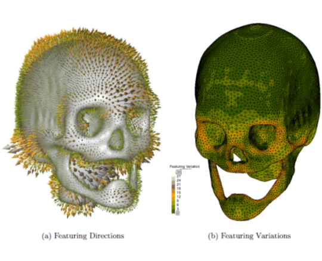
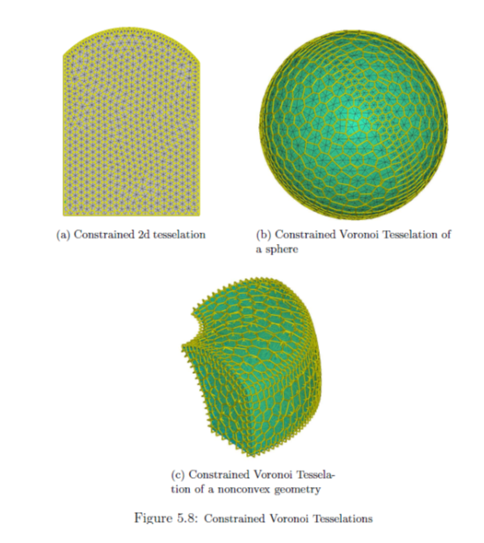
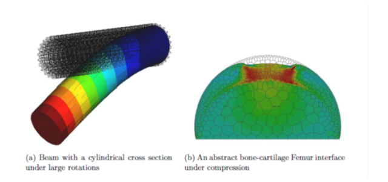
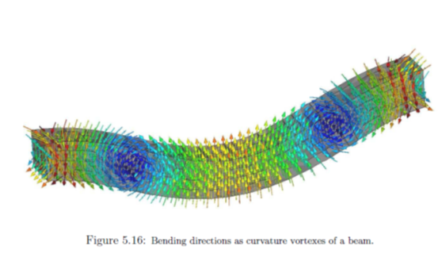
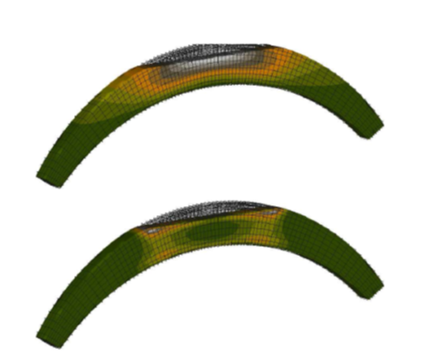
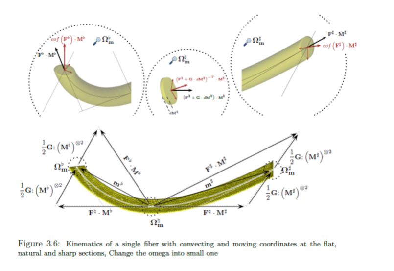

# natural_element_method_solver
This repo contains a PDE solver written in c++. 
The whole theory can be taken from The theory of the whole can be taken from: [https://mediatum.ub.tum.de/doc/1230956/1230956.pdf](https://mediatum.ub.tum.de/doc/1230956/1230956.pdf)
You can access there more references about the topic. 

## What is all contained in the code, what does it

* a crs matrix/vector library
* a veronoi/delaunay triangulater (tesselation as well)
* constrained of above to deal with arbitrary geometries
* bunch of inputs
* finite element formulations - including geometric and material nonlinearities
* implementation of theory of porous media
* growth (biological)
* fiber reinforces anisotropic material formulation
* contact
* and more

It is not an easy task to clarify all of these, at the end, the repo is only for the purpose "keeping the things tracked". 
but some pics might help to understand: 

mesh:

kinematics with strain gradient effects: 

